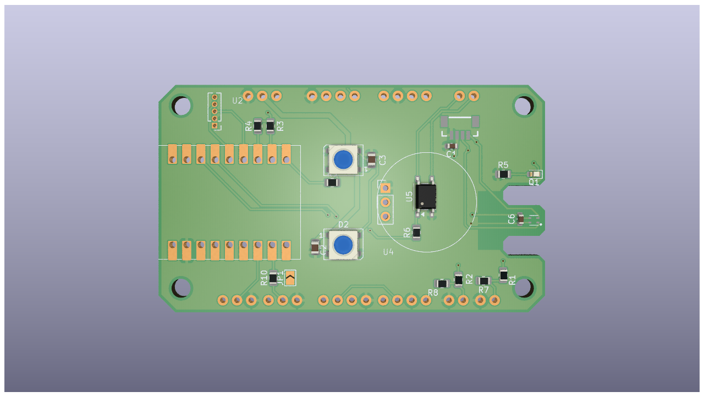
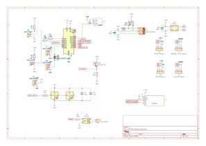

ESPhome Multisensor

This project is a compact ESPhome-compatible multisensor. The PCB is designed so that all required components can be hand-soldered — no SMD reflow oven or pick-and-place machine is required.

Quick facts:
- **Type:** ESPhome Multisensor
- **Feature:** Hand-solderable components only
- **Use:** Environmental monitoring (temperature, humidity, pressure, motion — depending on populated sensors)

Quickstart:
1. Populate the PCB by hand (all components are through-hole or hand-solderable).
2. Configure the ESP32 with ESPhome and flash the firmware.
3. Connect the device to Wi‑Fi and integrate the sensors into ESPhome/Home Assistant.

Images:

Notes:
- The BOM is available in the `build/fabrication/` folder.
- If you need help with soldering or ESPhome configuration, feel free to ask.
