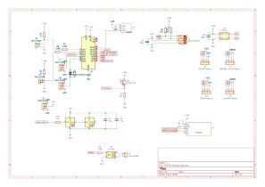
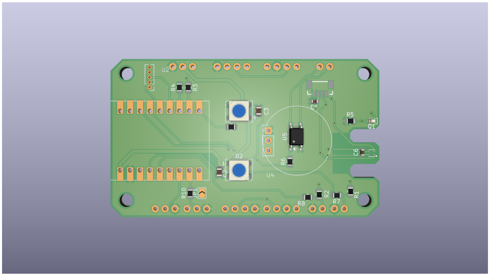

# ESPhome Multisensor

This project is a compact ESPhome-compatible multisensor. The PCB is designed so that all required components can be hand-soldered — no SMD reflow oven or pick-and-place machine is required only SMD soldering.
The shield is modular that it is proepared to be use for multiple purpuses. But the major use case would be a as a ESPHome sendor with multiple senspr values available:

## Features

- Measureing temperature and humidity with the onboard SHT40 I2C sensor
- Measureing brightness with PT19-21C
- Read human pressence with LD2410B mmWave sensor
- Read Movement with PIR sensor SR602
- 2x Onboard WS2812B LEDs For addressable color light
- SolidState Relais TLP175A for poential free contact
- Solder connetions for several sensor Modules like
  - BME280 -> temperature and humidity and air pressure
  - SCD40 -> CO2, temperature and humidity
  - SHT40 -> temperature and humidity
  - and many others
- QWIIC connector if it is neessessary to connect someting that ist compatible with QWIIC

The idear is to have one general perpuse PCB and only solder what is nessessary for the use case.
For examle, if i want to use a SCD40 Sensor to measure the CO2 level in a room i dont want to have another sensor like SHT40 to measure temperature and humidity since the SCD40 alreadx provides this data

Images:

Notes:
  - Gerber available form the actions 
